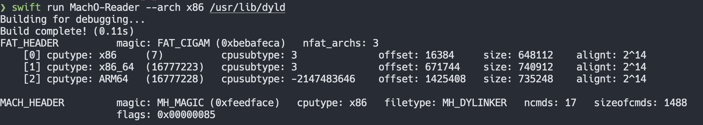

# MachO-Reader

Playground project to learn more about the Mach-O file format.

## How to run

`swift run macho-reader <path-to-binary>`

You should see a similar output:

## Sources

1. [Parsing Mach-O Files](https://lowlevelbits.org/parsing-mach-o-files/)
2. [llios](https://github.com/qyang-nj/llios)
3. [Hello, Mach-O](https://www.raywenderlich.com/books/advanced-apple-debugging-reverse-engineering/v3.0/chapters/18-hello-mach-o)
4. [Swift metadata](https://knight.sc/reverse%20engineering/2019/07/17/swift-metadata.html)
5. [Machismo](https://github.com/g-Off/Machismo)
6. [Mach-O Executable](https://www.objc.io/issues/6-build-tools/mach-o-executables/)

## Source files

Mach-O implementation details can be in Xcode's folder. In my case this is the path:

`/Applications/Xcode-System.app/Contents/Developer/Platforms/iPhoneOS.platform/Developer/SDKs/iPhoneOS.sdk`

These are some useful relative paths:
1. `/usr/include/mach-o/loader.h`
2. `/usr/include/mach/vm_prot.h`

