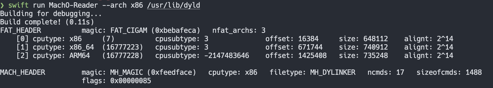

# MachO-Reader

Playground project to learn more about the Mach-O file format. It parses Mach-O
binaries (including fat/universal ones) into headers, load commands, and a few
higher-level reports (symbol table, dyld chained fixups), and exposes them
through both a library and a `macho-reader` CLI.

## Install

```bash
make install    # builds a release binary and installs it into $HOME/bin (no sudo)
make uninstall   # removes it again
```

## CLI

The `macho-reader` executable has three subcommands. `info` is the default,
so a bare path is equivalent to `macho-reader info <path>`.

```bash
swift run macho-reader <path-to-binary>                        # info (default): header + load commands
swift run macho-reader chained-fixups <path-to-binary>          # LC_DYLD_CHAINED_FIXUPS: imports, segments, pages
swift run macho-reader symbols <path-to-binary>                 # LC_SYMTAB entries
```

Each subcommand supports `--format json` for machine-readable output, e.g.
`swift run macho-reader <path> --header --format json`.

You should see a similar output:


## Library

Add the package as a dependency:

```swift
dependencies: [
    .package(url: "https://github.com/<owner>/MachO-Reader", from: "1.0.0"),
]
```

Then parse a binary and walk its load commands:

```swift
import MachOReaderLib

let file = try MachOFile(from: URL(fileURLWithPath: "/bin/ls"), arch: nil)

print(file.header)

for command in file.commands {
    switch command.commandType() {
    case let .dylibCommand(dylib):
        print(dylib.dylib.name)
    default:
        break
    }
}

let symbols = try file.symbolTableReport().symbols
print(symbols.count)
```

## Sources

1. [Parsing Mach-O Files](https://lowlevelbits.org/parsing-mach-o-files/)
2. [llios](https://github.com/qyang-nj/llios)
3. [Hello, Mach-O](https://www.raywenderlich.com/books/advanced-apple-debugging-reverse-engineering/v3.0/chapters/18-hello-mach-o)
4. [Swift metadata](https://knight.sc/reverse%20engineering/2019/07/17/swift-metadata.html)
5. [Machismo](https://github.com/g-Off/Machismo)
6. [Mach-O Executable](https://www.objc.io/issues/6-build-tools/mach-o-executables/)

## Source files

Mach-O implementation details can be in Xcode's folder. In my case this is the path:

`/Applications/Xcode-System.app/Contents/Developer/Platforms/iPhoneOS.platform/Developer/SDKs/iPhoneOS.sdk`

These are some useful relative paths:
1. `/usr/include/mach-o/loader.h`
2. `/usr/include/mach/vm_prot.h`

